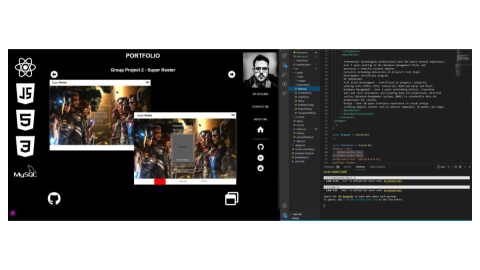

# MY PORTFOLIO 


 ## Table of Contents.
 * [Overview](#overview)
 * [Design](#overview)
 * [Criteria](#given-criteria)
 * [Questions](#have-questions)
 * [Links](#links)
 ---


## Overview 
Assigned to update my portfolio page and other materials to build toward being employer-competitive.

## Design


Simple black and white color palette used to match portrait photo, page opens onto slideshow that viewer is able to scroll through. site scales to screen size and navigation opens external sites in new tabs.


---
## Given Criteria
* Updated portfolio featuring at least 3 examples of student work from either deployed projects of homeworks

* Update GitHub profile with pinned repositories featuring at least 3 examples of student work from either deployed projects of homeworks

* Updated resume

* Updated LinkedIn profile


1. Display your contact information. If you don't want to share your personal email or phone number, use a separate email that you will only use for coding, also known as a developer email, and/or a call forwarding service, such as [Google Voice](https://voice.google.com/).

2. Have links to your GitHub profile and LinkedIn profile

3. Have a link to a downloadable PDF of your resume

4. Display at least 3 examples of student work from either deployed projects or assignments. For each project, make sure you have the following:

	* Project title

	* Link to the deployed version

	* Link to the GitHub repository

	* Screenshot of the deployed application

5. Have a polished, mobile-responsive user interface

---
## Have Questions
### You can contact me at:

    GITHUB: <https://github.com/ZacharyWK>

    EMAIL: <ZachKrause@live.com>


---
## Links
[REPOSITORY](https://github.com/ZacharyWK/20210729-react-portfolio-zk)
```
https://github.com/ZacharyWK/20210729-react-portfolio-zk
```

[DEPLOYED](https://z-k-portfolio.herokuapp.com/)
```
https://z-k-portfolio.herokuapp.com/
```

